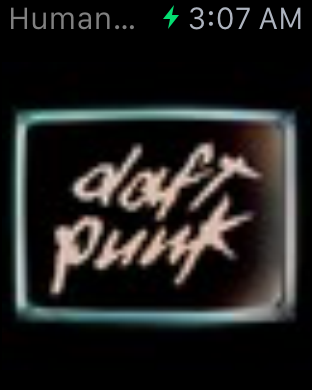
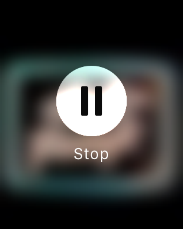

# CoolSpot

My little playground [Spotify][1] app, using the [new SDK](https://github.com/spotify/ios-sdk) and Swift. 

It comes with a ᴡᴀᴛᴄʜ app which simply starts playing your saved
songs randomly on the iPhone when opened. You can tap to skip and force touch to start/stop playback. Dont't forget to launch it once on your phone to sign into your
[Spotify][1] account.

## Building

Do a 

    $ make pod

and then open the workspace and you should be good to go.

Doing so the first time will install [CocoaPods][2] for you automatically and will
ask you for a [Spotify][1] client ID. You can obtain one in the [developer center][2] by creating an application under *My Apps* - make sure to set `coolspot://callback` as the *Redirect URI*. The ID is stored in your keychain via [cocoapods-keys][3].

## Help needed

Follow [@NeoNacho](https://twitter.com/NeoNacho) to help me beat [@orta](https://twitter.com/orta) in followers count.

[1]: https://www.spotify.com/
[2]: https://developer.spotify.com
[3]: https://github.com/orta/cocoapods-keys
